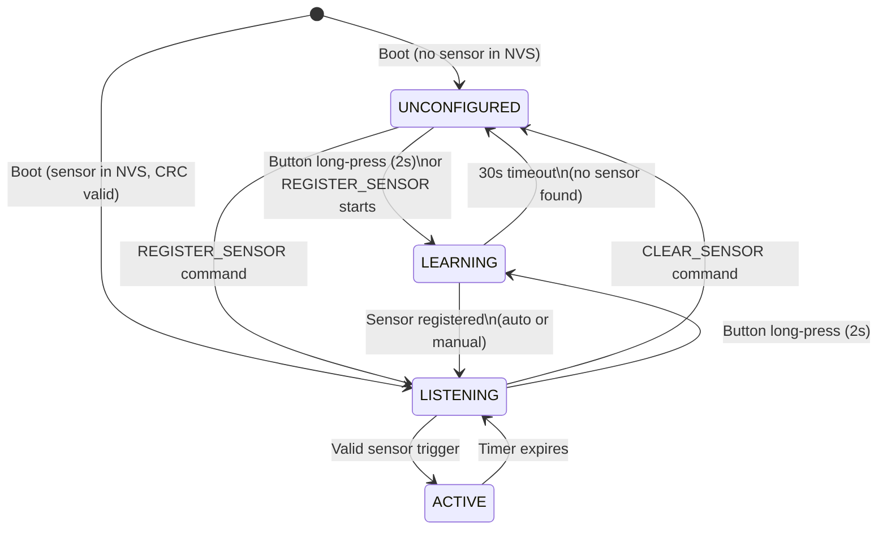
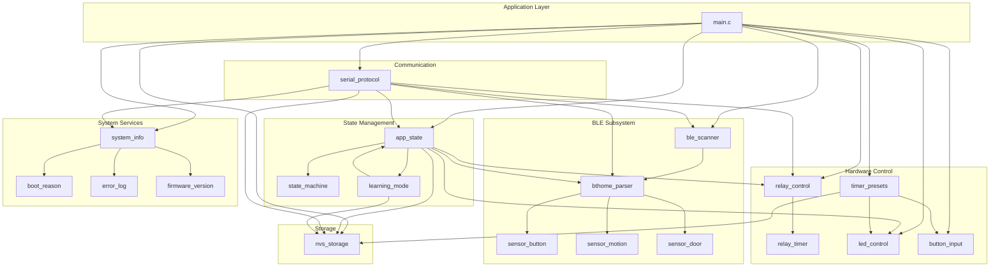
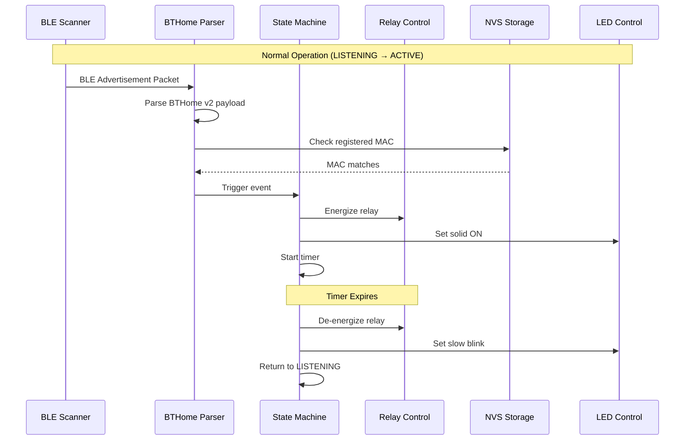

# ESP32-C3 Relay Module - Architecture Documentation

## Overview

The ESP32-C3 Relay Module firmware provides BLE sensor-triggered relay control with configurable timer functionality. It supports Shelly BLU Button, motion sensors, and door/window sensors via the BTHome v2 protocol.

---

## 1. State Machine

The system operates in four states, managed by the `state_machine` component.

### State Diagram



### State Details

| State | Description | Status LED (GPIO10) | Error LED (GPIO0) | Relay (GPIO7) |
|-------|-------------|---------------------|-------------------|---------------|
| **UNCONFIGURED** | No sensor registered, waiting for configuration | OFF | OFF | OFF |
| **LEARNING** | 30-second learning mode active, scanning for BLE sensors | Fast blink (500ms) | OFF | OFF |
| **LISTENING** | Sensor registered, monitoring for BLE trigger events | Slow blink (2s cycle) | OFF | OFF |
| **ACTIVE** | Relay energized, timer countdown running | Solid ON | OFF | **ON** |

### State Transitions

| From | To | Trigger | Additional Actions |
|------|----|---------|--------------------|
| UNCONFIGURED | LEARNING | Button long-press (2s) | Start 30s timeout timer |
| UNCONFIGURED | LISTENING | `REGISTER_SENSOR` command | Save config to NVS |
| LEARNING | LISTENING | Sensor detected or registered | Save config, cancel timeout |
| LEARNING | UNCONFIGURED | 30s timeout | Clear pending capture |
| LISTENING | ACTIVE | Valid BLE sensor event | Energize relay, start timer |
| LISTENING | UNCONFIGURED | `CLEAR_SENSOR` command | Erase NVS config |
| LISTENING | LEARNING | Button long-press (2s) | Start 30s timeout timer |
| ACTIVE | LISTENING | Timer expires | De-energize relay |

### LED Patterns Reference

| Pattern | Timing | Usage |
|---------|--------|-------|
| OFF | Solid off | Unconfigured state |
| ON | Solid on | Active state (relay energized) |
| BLINK_FAST | 250ms on / 250ms off | Learning mode |
| BLINK_SLOW | 1000ms on / 1000ms off | Listening state |
| ERROR_SINGLE | 1 blink, 1s pause | Error indication |
| ERROR_DOUBLE | 2 blinks, 1s pause | NVS corruption / critical error |
| ERROR_TRIPLE | 3 blinks, 1s pause | BLE initialization failure |

---

## 2. Serial Protocol Specification

### Connection Parameters

- **Baud Rate:** 115200
- **Data Bits:** 8
- **Parity:** None
- **Stop Bits:** 1
- **Line Terminator:** `\n` (newline)
- **Interface:** USB Serial JTAG (built-in on ESP32-C3)

### Command Format

```
COMMAND [ARG1] [ARG2]\n
```

Commands are case-insensitive. Arguments are separated by spaces.

### Response Formats

**Success Response:**
```
OK|data\n
```

**Error Response:**
```
ERROR|code|message\n
```

### Command Reference

| Command | Arguments | Description | Example Response |
|---------|-----------|-------------|------------------|
| `STATUS` | None | Get comprehensive system status (JSON) | `OK|{"state":"listening",...}` |
| `HELP` | None | List available commands | `OK|help` |
| `RELAY` | `ON` or `OFF` | Manual relay control | `OK|relay_on` |
| `HW_TEST` | None | Hardware validation (button-triggered) | `OK|hw_test_complete` |
| `BLE_SCAN` | None | List recently seen BLE devices | `OK|devices|5` |
| `BLE_EVENTS` | None | Show last 10 sensor events | `OK|events|3` |
| `GET_ERRORS` | None | Show last 10 system errors | `OK|errors|2` |
| `REGISTER_SENSOR` | `MAC TYPE` | Register sensor manually | `OK|registered|AA:BB:CC:DD:EE:FF|BUTTON` |
| `CLEAR_SENSOR` | None | Clear sensor configuration | `OK|cleared` |
| `SET_TIMER` | `1-600` | Set timer duration (seconds) | `OK|timer_set|60` |
| `SET_RETRIGGER` | `EXTEND` or `IGNORE` | Set retriggering mode | `OK|retrigger_set|EXTEND` |

### Error Codes

| Code | Description |
|------|-------------|
| `invalid_command` | Unknown command |
| `invalid_argument` | Missing or malformed argument |
| `INVALID_MAC` | MAC address format invalid (must be `AA:BB:CC:DD:EE:FF`) |
| `INVALID_TYPE` | Sensor type invalid (must be BUTTON, MOTION, or DOOR) |
| `INVALID_FORMAT` | Argument format invalid (e.g., non-integer for timer) |
| `INVALID_RANGE` | Value out of valid range |
| `INVALID_MODE` | Retrigger mode invalid (must be EXTEND or IGNORE) |
| `NVS_FAILURE` | Failed to read/write NVS storage |
| `relay_error` | Relay control operation failed |
| `ble_error` | BLE operation failed |
| `hw_test_timeout` | HW_TEST button not pressed within 30s |

### Example Sessions

**Check system status:**
```
STATUS
OK|{"state":"listening","relay":"off","timer_remaining_sec":0,"sensor":{"registered":true,"mac":"AA:BB:CC:DD:EE:FF","type":"BUTTON","battery":85,"last_seen_sec_ago":5,"rssi":-52,"in_range":true},"config":{"timer_duration_sec":30,"retrigger_mode":"EXTEND"},"firmware":{"version":"1.0.0","boot_reason":"POWER_ON"},"errors":{"count":0,"last_error":null}}
```

**Register a sensor manually:**
```
REGISTER_SENSOR AA:BB:CC:DD:EE:FF MOTION
OK|registered|AA:BB:CC:DD:EE:FF|MOTION
```

**Set timer duration:**
```
SET_TIMER 120
OK|timer_set|120
```

**View BLE scan results:**
```
BLE_SCAN
OK|devices|2
AA:BB:CC:DD:EE:FF|-52|5
11:22:33:44:55:66|-78|12
```

---

## 3. NVS Schema Documentation

### Namespace

All configuration is stored in the `relay_config` NVS namespace.

### Keys and Types

| Key | Type | Size | Valid Range | Default | Description |
|-----|------|------|-------------|---------|-------------|
| `sensor_mac` | string | 18 bytes | `AA:BB:CC:DD:EE:FF` format | `""` | Registered sensor MAC address |
| `sensor_type` | uint8_t | 1 byte | 0-3 | 0 | Sensor type enum |
| `timer_seconds` | uint16_t | 2 bytes | 1-600 | 300 | Relay timer duration |
| `retrigger_mode` | uint8_t | 1 byte | 0-1 | 0 | Timer retriggering behavior |
| `config_version` | uint8_t | 1 byte | 1+ | 1 | Schema version for migration |
| `config_crc` | uint32_t | 4 bytes | - | 0 | CRC32 checksum for integrity |

### Sensor Type Values

| Value | Constant | Description |
|-------|----------|-------------|
| 0 | `SENSOR_TYPE_NONE` | No sensor configured |
| 1 | `SENSOR_TYPE_BUTTON` | Shelly BLU Button |
| 2 | `SENSOR_TYPE_MOTION` | Motion sensor (PIR) |
| 3 | `SENSOR_TYPE_DOOR` | Door/window contact sensor |

### Retrigger Mode Values

| Value | Mode | Description |
|-------|------|-------------|
| 0 | `EXTEND` | New sensor triggers reset the timer countdown |
| 1 | `IGNORE` | New triggers are ignored while relay is active |

### CRC32 Calculation

The CRC32 checksum validates configuration integrity on load.

**Algorithm:** CRC32-LE (ESP-IDF ROM implementation)
**Polynomial:** IEEE 802.3 (0xEDB88320)
**Initial Value:** 0xFFFFFFFF

**Field Order for CRC Calculation:**
1. `sensor_mac` (18 bytes)
2. `sensor_type` (1 byte)
3. `timer_seconds` (2 bytes)
4. `retrigger_mode` (1 byte)
5. `config_version` (1 byte)

The `config_crc` field itself is **excluded** from the calculation.

### Factory Defaults

When no configuration exists or after `CLEAR_SENSOR`:
- `sensor_mac`: empty string
- `sensor_type`: 0 (NONE)
- `timer_seconds`: 300 (5 minutes)
- `retrigger_mode`: 0 (EXTEND)
- `config_version`: 1

### Corruption Detection and Recovery

On boot, the firmware loads configuration and validates the CRC:

1. **CRC Valid:** Normal operation, enter LISTENING state
2. **CRC Mismatch:**
   - Relay forced OFF immediately (safety-critical)
   - Error LED shows double-blink pattern
   - Error logged: `NVS_CRC_FAIL`
   - State set to UNCONFIGURED
   - User can recover via `CLEAR_SENSOR` then reconfigure

---

## 4. Component Architecture

### Component Diagram



### Component Descriptions

| Component | Path | Purpose |
|-----------|------|---------|
| **app_state** | `components/app_state/` | State machine and learning mode coordination |
| **ble_scanner** | `components/ble_scanner/` | BLE GAP scanning, device tracking |
| **bthome_parser** | `components/bthome_parser/` | BTHome v2 protocol parsing, sensor handlers |
| **button_input** | `components/button_input/` | GPIO9 button detection with debounce |
| **led_control** | `components/led_control/` | Status/error LED patterns (GPIO10, GPIO0) |
| **nvs_storage** | `components/nvs_storage/` | NVS configuration persistence with CRC |
| **relay_control** | `components/relay_control/` | Relay GPIO control (GPIO7) and timer |
| **serial_protocol** | `components/serial_protocol/` | USB Serial JTAG command interface |
| **system_info** | `components/system_info/` | Boot reason, error log, firmware version |
| **timer_presets** | `components/timer_presets/` | Button-based timer preset cycling |

### Data Flow



### Initialization Order

The `app_main()` function initializes components in this safety-critical order:

1. **boot_reason_init()** - Capture reset reason before logging
2. **error_log_init()** - Enable error logging
3. **relay_init()** - **CRITICAL:** Ensure relay OFF state (fail-safe)
4. **button_init()** - Button GPIO configuration
5. **led_init()** - LED GPIO and pattern task
6. **nvs_storage_init()** - NVS flash initialization
7. **nvs_load_config()** - Load and validate configuration
8. **timer_presets_init()** - Button-based timer cycling
9. **serial_protocol_init()** - USB Serial command interface
10. **bthome_init()** - BTHome parser and handlers
11. **ble_scanner_init()** - BLE stack and scanning
12. **learning_mode_init()** - Learning mode subsystem
13. **Watchdog configuration** - 10-second TWDT timeout
14. **Main loop task** - Button/learning mode processing

### GPIO Assignments

| GPIO | Function | Direction | Notes |
|------|----------|-----------|-------|
| GPIO0 | Error LED (Red) | Output | Strapping pin - safe with LED circuit |
| GPIO7 | Relay Control | Output | Active HIGH, fail-safe default OFF |
| GPIO9 | Button Input | Input | Active LOW with internal pull-up |
| GPIO10 | Status LED (White) | Output | Active HIGH |

### FreeRTOS Tasks

| Task | Stack | Priority | Purpose |
|------|-------|----------|---------|
| `main_loop` | 4096 | 5 | Button monitoring, learning mode, WDT feed |
| `serial_proto` | 4096 | 2 | Serial command processing |
| `led_pattern` | 2048 | 3 | Non-blocking LED pattern execution |
| `button_monitor` | 2048 | 5 | Button debounce and press detection |

---

## 5. Safety Features

### Fail-Safe Defaults

- **Relay defaults to OFF** on boot, error, or power loss
- **CRC validation** prevents operation with corrupted configuration
- **10-second watchdog** resets system on task hang
- **relay_force_off()** called before any error halt

### Error Recovery

| Error | LED Pattern | Recovery Action |
|-------|-------------|-----------------|
| NVS CRC mismatch | Double blink (red) | `CLEAR_SENSOR` then reconfigure |
| BLE init failure | Triple blink (red) | Power cycle |
| Watchdog timeout | - | Automatic reset |

---

## Version History

| Version | Date | Changes |
|---------|------|---------|
| 1.0.0 | 2026-01-27 | Initial architecture documentation |
