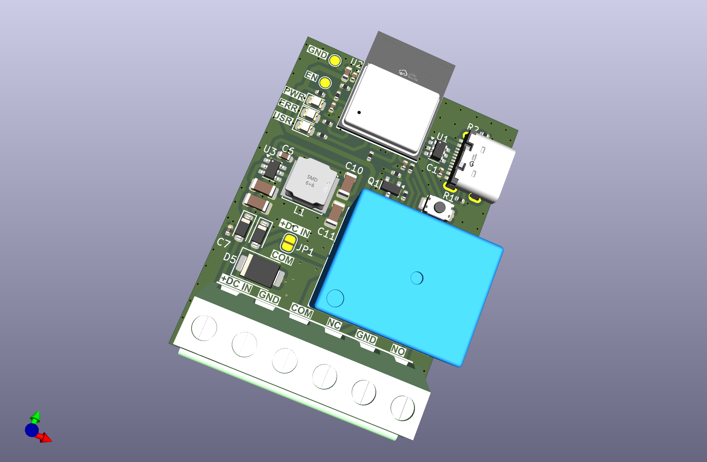

# ESP32C3 Relay Module

A BLE-enabled relay controller for home automation. Connect Shelly BLU sensors to switch 12-24V loads — no WiFi, no cloud, no app required.



## Features

- **BTHome v2 sensor support** — Shelly BLU Button, Motion, and Door/Window sensors
- **30-second learning mode** — just press a button and trigger your sensor
- **Button-based timer presets** — 30s, 60s, 120s, or 300s (no computer needed)
- **Optional serial interface** — for advanced configuration and debugging
- **Safety-first design** — watchdog timer, fail-safe relay defaults (OFF on boot/reset)

## Default Settings

| Setting | Default | Description |
|---------|---------|-------------|
| Timer | 300 seconds | How long relay stays on after trigger |
| Retrigger | EXTEND | New triggers reset the timer countdown |
| State | UNCONFIGURED | Waiting for sensor registration |

## Quick Start (Button Only — No Serial Needed!)

1. **Power on** the module via USB-C or DC input → Status LED is OFF (unconfigured)
2. **Long press** the button for 2+ seconds → Status LED fast blinks (learning mode)
3. **Trigger your sensor** within 30 seconds (press button, wave at motion sensor, open door)
4. **Sensor registered** → Status LED slow blinks (listening, ready to use)
5. **Done!** Your sensor now controls the relay with a 5-minute timer

### Changing the Timer (Button Only)

While in listening mode (slow blink), use short presses to cycle through timer presets:

1. **Short press** (< 0.5 sec) → LED shows current preset with counted blinks
2. **Short press again** → Cycles to next preset
3. **Wait 5 seconds** → Preset saved automatically

| LED Blinks | Timer Duration |
|------------|----------------|
| 1 blink | 30 seconds |
| 2 blinks | 60 seconds |
| 3 blinks | 120 seconds |
| 4 blinks | 300 seconds (default) |

Settings persist across power cycles.

## LED Status Patterns

### Status LED (White)

| Pattern | Meaning |
|---------|---------|
| OFF | Unconfigured — no sensor registered |
| Fast blink (250ms) | Learning mode — 30 second window active |
| Slow blink (1s) | Listening — ready for sensor triggers |
| Solid ON | Relay active — timer running |

### Error LED (Red)

| Pattern | Meaning |
|---------|---------|
| 1 blink | Sensor battery low (< 20%) |
| 2 blinks | NVS storage error |
| 3 blinks | BLE initialization failure |

## Example: Motion-Activated Under-Counter Lights

Use a Shelly BLU Motion sensor to automatically turn on kitchen LED strip lighting.

**Wiring:**
- Connect 12V LED strip positive to relay **NO** (Normally Open) terminal
- Connect LED strip negative to power supply ground
- Connect relay **COM** (Common) to 12V power supply positive
- Power the module via the same 12V supply (DC input) or separate USB-C

**Setup:**
1. Power on the module
2. Long press button (2+ seconds) → fast blink
3. Walk past the motion sensor → sensor registered, slow blink
4. Short press button twice → cycles to 60-second preset (2 blinks)
5. Wait 5 seconds → preset saved

**Result:** Motion now triggers 60 seconds of under-counter lighting!

## Hardware Overview

- **MCU**: ESP32-C3-MINI-1 (RISC-V, BLE 5.0)
- **Relay**: 10A contacts (NO/NC/COM), 3VDC coil
- **Power**: USB-C (5V) or external DC (12-24V) with auto-switching
- **Interface**: Physical button + status/error LEDs

### GPIO Pinout

| GPIO | Function |
|------|----------|
| 0 | Error LED (red) |
| 7 | Relay control |
| 9 | User button (active low) |
| 10 | Status LED (white) |

## Serial Interface (Advanced)

Connect via USB at **115200 baud** for advanced configuration:

| Command | Description |
|---------|-------------|
| `STATUS` | Show current state, sensor info, timer settings |
| `RELAY ON` / `RELAY OFF` | Manual relay control for testing |
| `SET_TIMER <1-600>` | Set timer duration in seconds |
| `SET_RETRIGGER EXTEND` | New triggers reset timer (default) |
| `SET_RETRIGGER IGNORE` | Ignore triggers while relay active |
| `BLE_EVENTS` | Show last 10 sensor trigger events |
| `CLEAR_SENSOR` | Unregister sensor, return to unconfigured |
| `HELP` | List all commands |

## Building the Firmware

### Prerequisites

- ESP-IDF v5.1.x or v5.2.x LTS
- ESP32-C3 target configured

### Build & Flash

```bash
cd Firmware/esp32c3-relay-firmware

# First time only
idf.py set-target esp32c3

# Build and flash
idf.py build flash -p /dev/ttyUSB0

# Monitor serial output
idf.py monitor -p /dev/ttyUSB0
```

## Documentation

- [Architecture & Serial Protocol](Firmware/esp32c3-relay-firmware/docs/architecture.md)
- [Hardware Pin Mapping](Hardware/ESP32C3-Pin-Mapping.md)
- [Firmware README](Firmware/esp32c3-relay-firmware/README.md)

## License

MIT License — see [LICENSE](LICENSE) for details.
